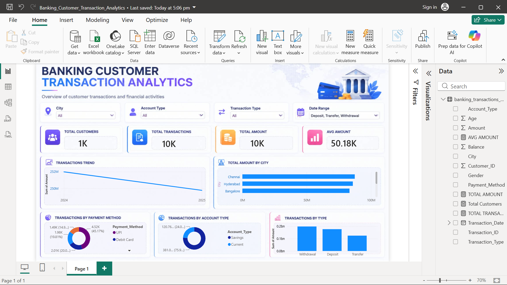

# 🏦 Banking Customer Transaction Analytics

An end-to-end data analytics project that analyzes banking customer transactions to identify transaction patterns, customer behavior, payment preferences, and business insights.

The project covers the complete analytics workflow — from data generation and cleaning to exploratory analysis, SQL analysis, visualization, and an interactive Power BI dashboard.

---

## 📊 Project Overview

**Banking Customer Transaction Analytics** is designed to analyze a simulated banking transaction dataset containing customer demographics, account information, transaction details, payment methods, transaction amounts, and balances.

The objective is to transform raw transaction data into meaningful business insights using Python, SQL, and Power BI.

---


## 🎯 Business Objectives

The project focuses on answering questions such as:

- How many transactions are recorded?
- What is the total transaction value?
- What is the average transaction value?
- How many unique customers are present?
- Which transaction types generate the highest transaction value?
- Which payment methods are most frequently used?
- Which cities contribute the highest transaction amounts?
- Which account types have the highest transaction activity?
- How do transaction values change over time?
- Which customers have the highest transaction activity?

---

## 🛠️ Tools & Technologies

| Tool | Purpose |
|------|---------|
| **Python** | Data generation, cleaning and analysis |
| **Pandas** | Data manipulation and analysis |
| **NumPy** | Numerical operations |
| **Matplotlib** | Data visualization |
| **Seaborn** | Statistical visualization |
| **SQL** | Business data analysis |
| **SQLite** | Database management |
| **Power BI** | Interactive dashboard |
| **Git** | Version control |
| **GitHub** | Project hosting |

---

## 🔄 Project Workflow

```text
Raw Data
   ↓
Data Generation
   ↓
Data Cleaning
   ↓
Exploratory Data Analysis
   ↓
Python Visualizations
   ↓
SQL Analysis
   ↓
Power BI Dashboard
   ↓
Business Insights


## 📊 Dashboard Preview


